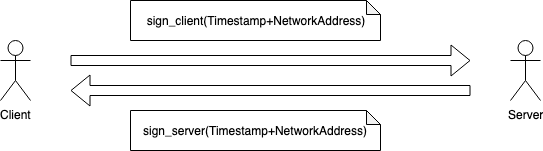

# `🌪 airwave`

A flexible P2P networking library for upgradable distributed systems. The core mission of `airwave` is to provide a simple P2P interface that can support a wide variety of different algorithms, with a focus on backwards compatible. The P2P interface supports:

- Peer discovery
- Handshake 
- Casting (send to one)
- Multicasting (send to many)
- Broadcasting (send to everyone)

### Handshake

Airwave uses a 2 way async handshake method to authorize peers in the network. The process is as follows:

The peers validate whether the timestamp is within the last minute, the address they are communicating is the address in the message and if the signature is valid.

Built with ❤ by Ren. 
