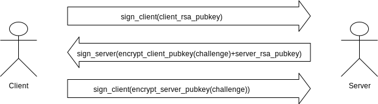

# `🌪 airwave`

A flexible P2P networking library for upgradable distributed systems. The core mission of `airwave` is to provide a simple P2P interface that can support a wide variety of different algorithms, with a focus on backwards compatible. The P2P interface supports:

- Peer discovery
- Handshake 
- Casting (send to one)
- Multicasting (send to many)
- Broadcasting (send to everyone)

### Handshake

Airwave uses a 3 way sync handshake method to authorize peers in the network. The process is as follows:

The initiator sends a signed rsa public key on connect. The responder validates the signature, generates a random challenge, and sends signned random challenge encrypted with the initiators public key and the responder's public key. The initator validates the signature decrypts the challenge encrypts it with the responder's publickey, signs it and sends it back.

Built with ❤ by Ren. 
